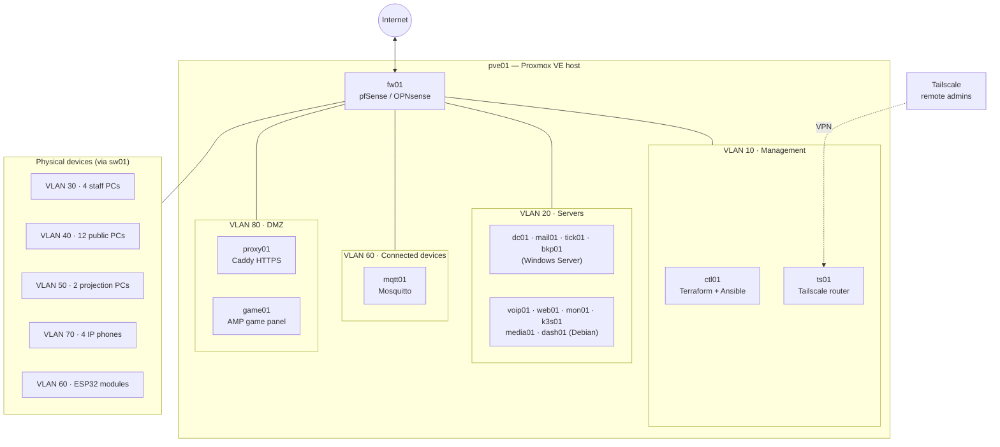

# entertainment-center-infra

Network and services infrastructure for a small entertainment center.

This project designs, builds and automates the whole IT infrastructure of the **Centre de divertissement de l'Estrie**, an entertainment centre in Sherbrooke that screens films, hosts networked game servers and offers public gaming and browsing workstations. It is the team project for the Network Implementation Project course in the *Techniques de l'informatique* (Computer Science Technology) program.

The centre has four employees and a single site, so the infrastructure has to stay simple to run while still providing what a larger organization would have: a directory, email, telephony, backups, monitoring, remote access and segmented networks.

## Highlights

- **One physical server, everything virtualized.** A single Proxmox VE host runs every service as a VM or LXC container, including the firewall.
- **Infrastructure as code.** Terraform provisions the VMs and containers, and Ansible configures them. Both run from a dedicated control station (`ctl01`).
- **Eight segmented VLANs** behind a pfSense/OPNsense firewall with a default-deny policy. The public workstations are fully isolated from the internal network.
- **Secure remote access** through Tailscale, with no fixed public IP needed. Web interfaces are published over HTTPS by a Caddy reverse proxy.
- **Linux or Windows per service.** Windows Server handles the directory, email, ticketing and backups. Debian handles everything else.
- **Connected devices.** Each team member builds an ESP32 module that talks to a TLS-encrypted Mosquitto MQTT broker.

## Architecture

### Network

The internal network uses `10.10.0.0/16`. Each VLAN gets its own `/24` whose third octet is the VLAN number, and the firewall holds the `.1` gateway address in every subnet.

| VLAN | Name                | Subnet          | Purpose                                    |
| ---- | ------------------- | --------------- | ------------------------------------------ |
| 10   | Management          | `10.10.10.0/24` | Proxmox, switch, firewall, control station |
| 20   | Servers             | `10.10.20.0/24` | Internal Linux and Windows services        |
| 30   | Staff               | `10.10.30.0/24` | Four staff workstations                    |
| 40   | Public workstations | `10.10.40.0/24` | Twelve self-service gaming PCs (isolated)  |
| 50   | Rooms               | `10.10.50.0/24` | Two projection workstations                |
| 60   | Connected devices   | `10.10.60.0/24` | MQTT broker and ESP32 modules              |
| 70   | Telephony           | `10.10.70.0/24` | IP phones                                  |
| 80   | DMZ                 | `10.10.80.0/24` | Reverse proxy and game servers             |

### Hosts and services

| Host      | Service                                        | Type     | OS             | VLAN | Address       |
| --------- | ---------------------------------------------- | -------- | -------------- | ---- | ------------- |
| `sw01`    | Managed core switch                            | Hardware | —              | 10   | `10.10.10.2`  |
| `pve01`   | Proxmox VE virtualization host                 | Server   | Proxmox        | 10   | `10.10.10.10` |
| `fw01`    | pfSense/OPNsense firewall and router           | VM       | FreeBSD        | 10   | `10.10.10.1`  |
| `ctl01`   | Terraform and Ansible control station          | LXC      | Debian         | 10   | `10.10.10.20` |
| `ts01`    | Tailscale subnet router                        | LXC      | Debian         | 10   | `10.10.10.21` |
| `dc01`    | Active Directory, DNS, DHCP                    | VM       | Windows Server | 20   | `10.10.20.10` |
| `mail01`  | hMailServer email                              | VM       | Windows Server | 20   | `10.10.20.11` |
| `tick01`  | osTicket help desk                             | VM       | Windows Server | 20   | `10.10.20.12` |
| `bkp01`   | Veeam Backup & Replication                     | VM       | Windows Server | 20   | `10.10.20.13` |
| `voip01`  | Asterisk IP telephony                          | LXC      | Debian         | 20   | `10.10.20.20` |
| `web01`   | LAMP web development server                    | LXC      | Debian         | 20   | `10.10.20.21` |
| `mon01`   | Netdata monitoring                             | LXC      | Debian         | 20   | `10.10.20.22` |
| `k3s01`   | Kubernetes (k3s)                               | VM       | Debian         | 20   | `10.10.20.31` |
| `media01` | Jellyfin, Radarr, Sonarr, Prowlarr, qBittorrent | LXC     | Debian         | 20   | `10.10.20.40` |
| `dash01`  | Homarr dashboard                               | LXC      | Debian         | 20   | `10.10.20.41` |
| `mqtt01`  | Mosquitto MQTT broker (TLS)                    | LXC      | Debian         | 60   | `10.10.60.10` |
| `proxy01` | Caddy reverse proxy (HTTPS)                    | LXC      | Debian         | 80   | `10.10.80.10` |
| `game01`  | AMP game server panel                          | VM       | Debian         | 80   | `10.10.80.20` |

Microsoft Defender for Endpoint protects the workstations and servers.

### Security

- The firewall is **default-deny**: any flow not explicitly allowed is blocked and logged.
- **Public workstations** (VLAN 40) can reach only the Internet (web), the firewall's DNS resolver and the game servers. They are blocked from every internal VLAN and don't join the domain.
- **Connected devices** (VLAN 60) can't reach the Internet or other VLANs, except for the Netdata agents reporting to `mon01`. MQTT runs only on TLS (port 8883).
- **Service web interfaces** are published over HTTPS by `proxy01`, and Caddy manages the certificates. The only exception is Jellyfin, which the projection PCs (VLAN 50) reach directly. The Proxmox and firewall admin interfaces are reachable only from the management VLAN.
- **Remote administration** goes through Tailscale. `ts01` advertises VLANs 10, 20 and 80, and Tailscale ACLs limit what each account can reach.
- **Internet-facing services** (email and game instances) use port forwarding and dynamic DNS on the firewall's WAN address.

The [network log](docs/10-network-log.md) lists every port and all 20 firewall rules.

## Tech stack

| Area                 | Tools                                                             |
| -------------------- | ----------------------------------------------------------------- |
| Virtualization       | Proxmox VE (VMs and LXC containers)                               |
| Provisioning         | Terraform                                                         |
| Configuration        | Ansible playbooks, plus one automation script per team member     |
| Orchestration        | Kubernetes (k3s)                                                  |
| Network and security | pfSense/OPNsense, VLANs, Tailscale, Caddy, Defender for Endpoint  |
| Directory            | Active Directory Domain Services (DNS, DHCP)                      |
| Communication        | hMailServer (email), Asterisk (VoIP)                              |
| Operations           | osTicket, Veeam Backup & Replication, Netdata, Homarr             |
| IoT                  | Mosquitto MQTT, ESP32                                             |
| Entertainment        | Jellyfin, \*arr suite, qBittorrent, AMP game server panel         |

## Roadmap

The project is in the **planning phase**. Implementation runs from week 6 to week 15 (September 28 to December 4, 2026), and the final deadline is December 11, 2026. The infrastructure code and scripts will be added to this repository as each work package is completed.

| Weeks     | Work package                                                     |
| --------- | ---------------------------------------------------------------- |
| W6 – W7   | Base infrastructure: Proxmox, network, VLANs, Terraform, Ansible (k3s continues until W12) |
| W8 – W9   | Security: firewall, Tailscale, firewall rules, Caddy             |
| W10 – W11 | Linux services, Windows services, MQTT and ESP32 modules         |
| W12       | Individual automation scripts                                    |
| W12 – W13 | Media stack, Homarr, AMP game servers                            |
| W14 – W15 | Testing, integration and documentation                           |

The critical path is infrastructure, then security, then services, then the media stack/Homarr/AMP, then testing: 10 weeks with no slack.

## Documentation

The project planning is in [`docs/`](docs/README.md). It covers the management plan, functional specification, risk analysis (FMECA), work breakdown, budgets, schedule (with the PERT chart) and the [network log](docs/10-network-log.md). The detailed figures (FMECA table, task table, budgets, Gantt chart and S-curve) are in the `Planification_calculs.xlsx` workbook, which isn't in this repository. The network log is the reference for the network's configuration and is updated with every change.

## Team

| Member               | Main responsibilities                                                                  |
| -------------------- | -------------------------------------------------------------------------------------- |
| Nicolas-André Anillo | Ansible automation, IP addressing and VLANs, firewall rules, MQTT, Jellyfin            |
| Alexy Després        | Terraform, Kubernetes (k3s), Asterisk VoIP, LAMP web server, Netdata                   |
| Joshua Leclerc       | hMailServer, osTicket, Veeam, Defender for Endpoint, Homarr                            |
| Loucas Viens         | Proxmox VE, physical network and VLANs, Active Directory, Tailscale, Caddy, \*arr, AMP |

## License

Released under the [MIT License](LICENSE).
