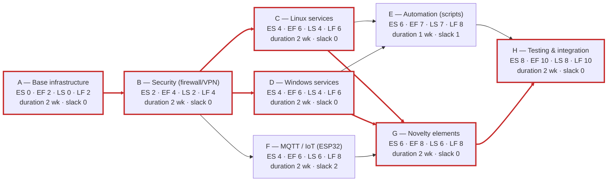

# 9. Initial Planning

The initial planning orders the tasks over time and highlights the logical sequence of the work. It includes the task schedule, the PERT chart of the main functions, the Gantt chart and the S-curve of the workload. The implementation spans ten weeks, from week 6 to week 15, i.e. from Monday, September 28 to Friday, December 4, 2026.

## 9.1 Task Schedule

The schedule groups the work packages and their positioning in time, based on the durations estimated in [section 6](06-task-list.md). It serves as the basis for the Gantt chart and the PERT chart.

| Package   | Description                                    | Period    | Duration           |
| --------- | ---------------------------------------------- | --------- | ------------------ |
| Package 0 | Project management (cross-cutting)             | W6 – W15  | 10 weeks           |
| Package 1 | Base infrastructure (Kubernetes spans 7 weeks) | W6 – W7   | 2 weeks to 7 weeks |
| Package 2 | Security                                       | W8 – W9   | 2 weeks            |
| Package 3 | Linux services                                 | W10 – W11 | 2 weeks            |
| Package 4 | Windows services                               | W10 – W11 | 2 weeks            |
| Package 6 | MQTT and connected devices                     | W10 – W11 | 2 weeks            |
| Package 5 | Automation                                     | W12       | 1 week             |
| Package 7 | Novelty elements                               | W12 – W13 | 2 weeks            |
| Package 8 | Testing, integration, documentation            | W14 – W15 | 2 weeks            |

## 9.2 PERT Chart

The PERT chart represents the network of the project's main functions and highlights the critical path, that is, the sequence of tasks with no slack that determines the minimum duration of the project. Each block indicates the earliest dates (ES, EF) and the latest dates (LS, LF), as well as the slack. The critical path runs through the infrastructure, security, services, novelty elements and testing, for a total duration of ten weeks. The total slack of a block is the delay it can incur without pushing back the end of the project (LS − ES); it is zero on the critical path.

**Critical path**: A → B → C/D → G → H (10 weeks)
**Legend**: ES | EF (top) · LS | LF (bottom) · critical path in red 

*Figure 2 — PERT chart of the main functions (critical path in red).*

## 9.3 Gantt Chart

The Gantt chart presents the calendar of the work packages over the implementation weeks. Project management is cross-cutting over the entire duration of the project; the Linux, Windows and MQTT services run in parallel, while testing and integration close the project.

The Gantt chart, which shows one bar per task (thirty-six bars) and highlights the critical path in red, is found in the “Planification” tab of the Planification_calculs.xlsx workbook, submitted with this report; its dates come from the “OTP” tab.

## 9.4 Initial S-Curve

The S-curve illustrates the cumulative planned workload over the weeks. It rises slowly at the start (infrastructure setup), accelerates at the heart of the project (parallel deployment of the services and novelty elements), then slows down as the testing and the final presentation approach. It will serve as the reference for comparing actual progress with planned progress. The corresponding chart is found in the same Planification tab of the workbook.
